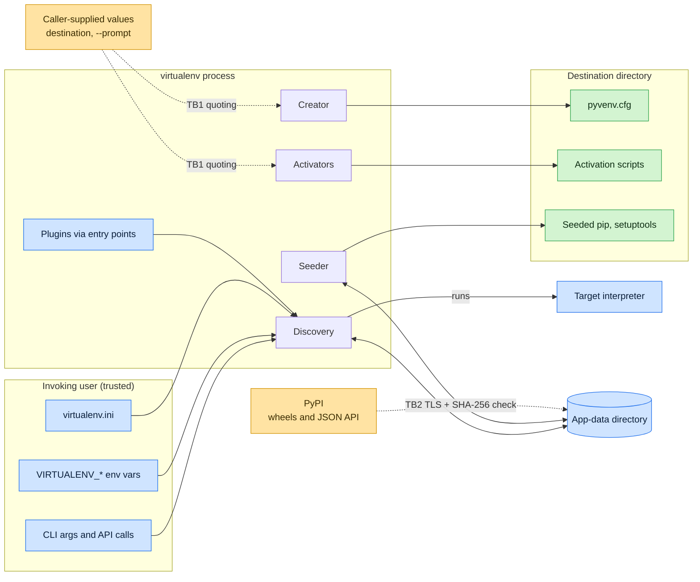
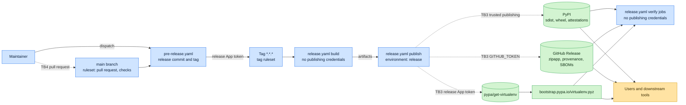

# Threat Model and Assurance Case

This document has two parts. The threat model lists what virtualenv trusts, its trust boundaries, the threats we expect
at each boundary and the current controls. The [assurance case](#assurance-case) at the end ties each control to its fix
and the tests behind it. [SECURITY.md][security] covers [reporting][security-report] through
[private vulnerability reporting][gh-pvr] and defines a vulnerability, and [INCIDENT_RESPONSE.md][ir] covers our
[response][ir-response] after a report. If this document contradicts SECURITY.md, we follow SECURITY.md and correct this
document.

We based the layout on the GitHub Secure Open Source Fund [threat modeling template for libraries][sosf-template] and
group threats by [STRIDE], one of the methods the [OWASP threat modeling guide][owasp-tm] covers. We took the split
between project promises and caller duties from the [Apache Commons][commons] and [Apache Shiro][shiro] models.

## Overview

virtualenv creates Python virtual environments, and [How virtualenv works][expl-how] explains the design. People run it
four ways: the `virtualenv` command, `python -m virtualenv`, the zipapp from a [GitHub Release][gh-releases] or
`https://bootstrap.pypa.io/virtualenv.pyz`, and the [Python API][api]. [tox] and [hatch] call the API or the command
with values they read from project configuration.

A run has four stages.

1. [Discovery][expl-discovery] finds and runs the target Python interpreter to learn its layout, and caches the answer
   in the [app-data directory][cli-app-data].
1. [Creation][expl-creators] writes the environment directory with interpreter links or copies,
   [`pyvenv.cfg`][src-pyenv-cfg], `CACHEDIR.TAG` and `.gitignore`, as [environment layout][env-layout] describes.
1. [Seeding][expl-seeders] installs pip and setuptools from wheels. virtualenv takes the wheels from the
   [copies embedded in its package][src-embed-dir], from newer wheels a [periodic update][expl-periodic] downloaded into
   app-data, from directories passed with [`--extra-search-dir`][cli-extra-search-dir], or from PyPI when the user sets
   [`--download`][cli-download].
1. [Activation][expl-activators] renders one [script per shell][src-activation] (bash, batch, csh, fish, Nushell,
   PowerShell, xonsh and Python) from templates and substitutes the destination path, the [prompt][cli-prompt] and the
   interpreter's Tcl/Tk paths.

Discoverers, creators, seeders and activators are [plugins][plugin-docs]. virtualenv [loads them][src-plugin-base] from
the `virtualenv.discovery`, `virtualenv.create`, `virtualenv.seed` and `virtualenv.activate` entry point groups of each
installed distribution.

## Scope

This model covers the released virtualenv package and zipapp, the files a run writes, the network requests a run makes,
and the pipeline that builds and publishes releases. pip, setuptools and the packages a user adds to an environment fall
outside it; those projects keep their own threat models. We exclude test code, fixtures and unreleased code on `main`
from this model and from the [SECURITY.md scope][security-scope].

## Trusted components

virtualenv runs with the full rights of the user who starts it and does what that user asks, so we draw no trust
boundary at the public API or the command line. An attacker who controls one of the components below is outside this
model.

- The invoking user and their environment, meaning command line options, `VIRTUALENV_*`
  [environment variables][usage-env], the `virtualenv.ini` [configuration file][usage-config-location] in the user
  configuration directory or at `VIRTUALENV_CONFIG_FILE`, and [pip's own configuration][pip-config] (`PIP_INDEX_URL`,
  `pip.conf`).
- The target interpreter. virtualenv executes it during discovery and creation, and the environment keeps pointing at
  it. A malicious interpreter has the user's rights with or without virtualenv.
- The filesystem at the destination. We assume no other user can write to the destination's parent directories.
  virtualenv refuses destinations it cannot write to, resolves the path before use, and since
  [GHSA-597g-3phw-6986][ghsa-597g] creates directories with atomic calls in place of check-then-create. It does not
  defend against another user racing it inside a directory both can write.
- The [app-data directory][src-app-data], a per-user cache directory from [platformdirs] unless the user picks another
  with [`--app-data`][cli-app-data] or [`VIRTUALENV_OVERRIDE_APP_DATA`][usage-override-app-data]. It holds downloaded
  wheels, extracted wheel images, cached interpreter information and the periodic update log. virtualenv reads these
  back without re-verifying them.
- Installed plugins. virtualenv imports each entry point in the four groups above on start-up, selected or not. A
  built-in entry point wins over a third-party one with the same name.
- PyPI over verified TLS. For seed wheels that `--download` or the [periodic update][src-periodic-update] fetches, pip
  downloads from the index in its configuration, and virtualenv compares the file's SHA-256 with the digest the
  [PyPI JSON API][pypi-json] publishes for that filename. On a mismatch virtualenv aborts before it caches or uses the
  wheel. If PyPI has no digest for the filename or the metadata request fails, virtualenv retries and refuses the wheel
  when the digest stays unavailable ([#3302][pr-3302]). For the bundled version it seeds the bundled wheel in its place,
  a pinned version such as `--pip 23.1` fails with an error, and a periodic update keeps the current wheel. virtualenv
  skips the check when the environment sets `PIP_INDEX_URL`, `PIP_EXTRA_INDEX_URL` or `PIP_INDEX`. virtualenv cannot see
  an index set in `pip.conf`, so it runs the PyPI check on those downloads and refuses a filename PyPI does not know.
- Directories passed with [`--extra-search-dir`][cli-extra-search-dir]. virtualenv uses the wheels it finds there as
  given, with no hash check, because the user chose that source.

virtualenv treats the content of caller-passed values as untrusted. A destination path or [`--prompt`][cli-prompt] may
come from project metadata the user did not write. Those values must reach `pyvenv.cfg` and the generated scripts as
data and must not change the meaning of the file. We put this boundary in scope in [SECURITY.md][security-scope].

## Assets

- Integrity of generated files. The user's shell sources an activation script, and the interpreter and other tools read
  `pyvenv.cfg`. Code an attacker injects into either runs as the user.
- Integrity of seeded wheels. pip and setuptools run with the user's rights in each environment virtualenv creates.
- Integrity of released artifacts, meaning the sdist and wheel on [PyPI][pypi-project], the zipapp and SBOMs on
  [GitHub Releases][gh-releases], and the zipapp that `bootstrap.pypa.io` serves from
  [pypa/get-virtualenv][get-virtualenv]. [Release artifacts][ra-files] lists each file. tox and hatch depend on
  virtualenv, so a tampered release reaches tox and hatch users as well as direct users.
- Maintainer and publishing credentials, meaning GitHub accounts with admin rights on `pypa/virtualenv`, PyPI owner
  accounts, the PyPI [trusted publisher][pypi-tp] configuration, and the private key of the
  [release GitHub App][release-app] in the `release` [deployment environment][gh-environments].
- The project's reputation, which downstream projects rely on when they depend on virtualenv without pinning it.

## Entry points and trust boundaries

The first diagram shows a run of virtualenv, the second how a release reaches users. Dashed arrows cross a trust
boundary.

| Boundary | Crossing                                                                                           | Controls                                                                                                                                                                                                     |
| -------- | -------------------------------------------------------------------------------------------------- | ------------------------------------------------------------------------------------------------------------------------------------------------------------------------------------------------------------ |
| TB1      | Caller-supplied values into activation scripts and `pyvenv.cfg`                                    | [Per-shell quoting][src-activation], [line boundary collapsing][src-text], [property tests][tests-property] and [fuzzing][atheris]                                                                           |
| TB2      | Wheel bytes from an index through app-data into an environment                                     | pip's TLS, SHA-256 comparison with PyPI's published digest, refusal when PyPI has none ([#3302][pr-3302])                                                                                                    |
| TB3      | Built artifacts from GitHub Actions to PyPI, GitHub Releases, get-virtualenv and bootstrap.pypa.io | [Trusted publishing][pypi-tp], [attestations][gh-attestations], [immutable releases][gh-immutable], [post-publish verification][workflow-release] of each destination                                        |
| TB4      | Code from contributors and dependencies into a release                                             | [Rulesets][gh-rulesets], [SHA-pinned actions][gh-sha-pinning], [embedded wheel hashes][src-embed-init], [wheel age gate][task-wheel-age], [pinned CI tool downloads][ci-tools], [zipapp lock][pylock-zipapp] |

## Threats and existing mitigations

We rate risk from likelihood and impact. High means likely and severe, Medium needs a specific setup or a less likely
event, and Low means unlikely or narrow in effect. We use the rating to order our own work and set the severity of a
reported vulnerability through [INCIDENT_RESPONSE.md][ir-severity]. Rows within each [STRIDE] group run from highest
risk to lowest.

### Spoofing

| ID  | Threat                                                                                                          | Risk   | Mitigation                                                                                                                                                                                                                                                                                                                                                                                                                                             |
| --- | --------------------------------------------------------------------------------------------------------------- | ------ | ------------------------------------------------------------------------------------------------------------------------------------------------------------------------------------------------------------------------------------------------------------------------------------------------------------------------------------------------------------------------------------------------------------------------------------------------------ |
| S1  | An attacker takes over a maintainer's GitHub or PyPI account and publishes a release.                           | High   | PyPI uploads use [trusted publishing][pypi-tp] from [release.yaml][workflow-release], so no long-lived PyPI token exists to steal. PyPI [requires 2FA][pypi-2fa] on each account. A [tag ruleset][gh-rulesets] reserves creating, moving and deleting tags for admins. Artifacts carry [attestations][gh-attestations] that tie them to the workflow, and [immutable releases][gh-immutable] block changes to GitHub release assets after publication. |
| S2  | An attacker registers a lookalike name on PyPI (`virtualenvs`, `virtual-env`) to catch users who mistype.       | Medium | PyPI resolves names that normalize to `virtualenv` under [PEP 503][pep-503] to this project. Other lookalikes are outside our control; we report them to [PyPI security][pypi-security].                                                                                                                                                                                                                                                               |
| S3  | A network attacker or a compromised mirror serves a different wheel under a genuine pip or setuptools filename. | Low    | pip verifies TLS. virtualenv [compares the downloaded file's SHA-256][src-periodic-update] with PyPI's record and refuses a mismatch ([GHSA-94p9-xgh2-xp45][ghsa-94p9]) or a wheel PyPI lists no digest for ([#3302][pr-3302]). Unless the user sets [`VIRTUALENV_PERIODIC_UPDATE_INSECURE`][usage-insecure], the PyPI metadata request has no unverified TLS fallback.                                                                                |
| S4  | A third-party package registers an entry point named like a built-in activator or creator to replace it.        | Low    | Built-in entry points win on a name collision ([plugin loading][src-plugin-base]). A package that can register entry points runs code at import, so the collision gives it no new capability.                                                                                                                                                                                                                                                          |

### Tampering

| ID  | Threat                                                                                                                     | Risk   | Mitigation                                                                                                                                                                                                                                                                                                                                                                                                                                                                                                                                                                                                                                                                                                                                                                                                                                                                                                                                                                                                                              |
| --- | -------------------------------------------------------------------------------------------------------------------------- | ------ | --------------------------------------------------------------------------------------------------------------------------------------------------------------------------------------------------------------------------------------------------------------------------------------------------------------------------------------------------------------------------------------------------------------------------------------------------------------------------------------------------------------------------------------------------------------------------------------------------------------------------------------------------------------------------------------------------------------------------------------------------------------------------------------------------------------------------------------------------------------------------------------------------------------------------------------------------------------------------------------------------------------------------------------- |
| T1  | An attacker puts shell syntax in a destination path, prompt or interpreter path, and an activation script runs it as code. | High   | Each [activator][src-activation] quotes caller values with rules for its shell. POSIX shells use the standard library's shell quoting, csh adds escaping for history and prompt expansion, and PowerShell, Nushell, xonsh and Python have their own rules. The [batch activator][src-batch] doubles percent signs, replaces cmd.exe operators and line breaks, and skips generation for paths it cannot represent. [Hypothesis] [property tests][tests-batch-quote] cover batch quoting, and [Atheris] fuzz targets cover [PowerShell][fuzz-powershell] and [Nushell][fuzz-nushell] quoting; [CI][workflow-check] runs both. Two advisories came from this class, [GHSA-x78j-v8h9-3j2q][ghsa-x78j] in the batch activator and [GHSA-p58f-9548-mpm2][ghsa-p58f] in the bash and fish activators.                                                                                                                                                                                                                                         |
| T2  | A caller value adds a line or a key to `pyvenv.cfg`.                                                                       | Medium | The [`pyvenv.cfg` writer][src-pyenv-cfg] [collapses line boundaries][src-text] in keys and values before writing ([GHSA-9h9j-4vrj-gf7g][ghsa-9h9j]). [Property tests][tests-pyenv-cfg] check that a written file keeps one line per key and gains no new key, and a [fuzz target][fuzz-pyenv-cfg] exercises the same writer.                                                                                                                                                                                                                                                                                                                                                                                                                                                                                                                                                                                                                                                                                                            |
| T3  | virtualenv embeds a compromised pip or setuptools release from PyPI.                                                       | Medium | The daily [upgrade workflow][workflow-upgrade] [skips wheels uploaded to PyPI in the last seven days][task-wheel-age] and opens a pull request for a maintainer to review. PyPI and the upstream project get that week to catch a bad upload. The workflow records whatever SHA-256 PyPI served, so we would hash and ship a malicious upstream release that stays up seven days like any other.                                                                                                                                                                                                                                                                                                                                                                                                                                                                                                                                                                                                                                        |
| T4  | A malicious pull request or a compromised GitHub Action alters a release.                                                  | Medium | The `main` [ruleset][gh-rulesets] requires a pull request and passing status checks across the CI matrix, and it blocks force pushes and deletion. We pin each action to a commit SHA and each [pre-commit hook][precommit-config] to a frozen commit, [Dependabot][dependabot-config] proposes updates after a seven-day [cooldown][dependabot-cooldown], and [zizmor] and [CodeQL][workflow-codeql] scan the workflows. CI checks the RustPython and Nushell downloads against SHA-256 values in [ci-tools.json][ci-tools], which the upgrade workflow refreshes each week ([#3293][pr-3293]). The build job has read-only repository access and no publishing credentials, its checkout does not persist credentials, and [harden-runner] logs outbound traffic in the build and publish jobs. No workflow uses [`pull_request_target`][gh-prt], so pull requests from forks run without secrets. The ruleset asks for one approval covering the last push, but admins bypass it, so we do not count a second reviewer as a control. |
| T5  | A compromised release of a runtime dependency (distlib, filelock, platformdirs, python-discovery) reaches users.           | Medium | The wheel and sdist declare [version ranges][pyproject], and each user's installer resolves them, so we cannot pin for them. [Dependabot][dependabot-config] checks them each week with a seven-day cooldown. The zipapp bundles the versions a [PEP 751][pep-751] lock pins by SHA-256, and the upgrade workflow refreshes the lock after the same seven-day cooldown ([#3306][pr-3306]).                                                                                                                                                                                                                                                                                                                                                                                                                                                                                                                                                                                                                                              |
| T6  | Someone modifies embedded wheels after the release build, on disk or inside the zipapp.                                    | Low    | The [embed module][src-embed-init] records the SHA-256 of each embedded wheel and checks it before first use in each process, reading from inside the zipapp when needed. The [wheel build][hatch-build] generates the embedded [CycloneDX] SBOM from the same table.                                                                                                                                                                                                                                                                                                                                                                                                                                                                                                                                                                                                                                                                                                                                                                   |
| T7  | Another local user redirects virtualenv's writes through a symlink or a race.                                              | Low    | We replaced check-then-create with atomic directory creation ([GHSA-597g-3phw-6986][ghsa-597g]). The [creator][src-creator] resolves the destination and checks write access before use. Directories shared with other users stay outside what we can defend; see accepted risks.                                                                                                                                                                                                                                                                                                                                                                                                                                                                                                                                                                                                                                                                                                                                                       |

### Repudiation

| ID  | Threat                                                                      | Risk | Mitigation                                                                                                                                                                                                                                                                                                                                                                                                                                                                                                                                                                                                                                                                                                                                                                                                                                                                     |
| --- | --------------------------------------------------------------------------- | ---- | ------------------------------------------------------------------------------------------------------------------------------------------------------------------------------------------------------------------------------------------------------------------------------------------------------------------------------------------------------------------------------------------------------------------------------------------------------------------------------------------------------------------------------------------------------------------------------------------------------------------------------------------------------------------------------------------------------------------------------------------------------------------------------------------------------------------------------------------------------------------------------ |
| R1  | A user cannot tell whether a published artifact came from the project's CI. | Low  | [PyPI attestations][pypi-attestations] cover the sdist and wheel, and a [SLSA build provenance][slsa-provenance] attestation ships beside the zipapp. [GitHub attestations][gh-attestations] bind the CycloneDX SBOM and its [SPDX] rendering to both distributions ([#3299][pr-3299]) and the zipapp SBOM to the zipapp ([#3310][pr-3310]). The wheel carries its SBOM as [PEP 770][pep-770] describes. GitHub signs a release attestation over the assets of each immutable release. The release pins timestamps to [`SOURCE_DATE_EPOCH`][sde] and the zipapp's bundled wheels to a [PEP 751][pep-751] lock, and the SBOMs record the build tools, so anyone can [rebuild the sdist, wheel and zipapp][verify-rebuild] and compare the bytes ([#3306][pr-3306], [#3311][pr-3311]). [Verify a virtualenv release][verify] shows each check. We do not require signed commits. |

### Information disclosure

| ID  | Threat                                                                    | Risk | Mitigation                                                                                                                                                                                                                                                                                       |
| --- | ------------------------------------------------------------------------- | ---- | ------------------------------------------------------------------------------------------------------------------------------------------------------------------------------------------------------------------------------------------------------------------------------------------------ |
| I1  | A publishing credential leaks through a workflow log, artifact or commit. | Low  | Trusted publishing leaves no PyPI token to leak. Workflows start with no token permissions or read-only access and grant more per job. We enabled [secret scanning][gh-secret-scanning] and [push protection][gh-push-protection]. [zizmor] flags template injection and credential persistence. |
| I2  | virtualenv exposes local details.                                         | Low  | By design, `pyvenv.cfg` records the interpreter path and the command that created the environment. The [periodic update][expl-periodic] contacts PyPI at a [fixed interval][src-periodic-update] unless the user passes [`--no-periodic-update`][cli-no-periodic-update].                        |

### Denial of service

| ID  | Threat                                                                                                           | Risk | Mitigation                                                                                                                                                                                                                                                                                                                                                                                                  |
| --- | ---------------------------------------------------------------------------------------------------------------- | ---- | ----------------------------------------------------------------------------------------------------------------------------------------------------------------------------------------------------------------------------------------------------------------------------------------------------------------------------------------------------------------------------------------------------------- |
| D1  | A PyPI outage or a failing download blocks environment creation.                                                 | Low  | [`--download`][cli-download] is off by default, so seeding needs no network. The periodic update runs in a detached background process, and its failure leaves the current run untouched.                                                                                                                                                                                                                   |
| D2  | The release workflow publishes to some destinations and fails on others, and users end up on different versions. | Low  | A [recovery job][workflow-release] reports partial publication, and the [development guide][dev-recovery] describes completing it with the original verified artifacts.                                                                                                                                                                                                                                     |
| D3  | bootstrap.pypa.io serves an older zipapp than the latest release.                                                | Low  | The release workflow's bootstrap verification job downloads each zipapp path on bootstrap.pypa.io, compares it byte for byte with the release asset, verifies its attestation, and fails the run when the served copy does not catch up ([#3309][pr-3309]). A [pypa/bootstrap][pypa-bootstrap] monitor failure left an older release on bootstrap.pypa.io until [pypa/bootstrap#12][bootstrap-12] fixed it. |

### Elevation of privilege

| ID  | Threat                                                                                                                    | Risk | Mitigation                                                                                                                                                                                                                          |
| --- | ------------------------------------------------------------------------------------------------------------------------- | ---- | ----------------------------------------------------------------------------------------------------------------------------------------------------------------------------------------------------------------------------------- |
| E1  | An attacker with write access to the app-data directory swaps a cached wheel, and the wheel runs in each new environment. | Low  | The default location is private to the user. virtualenv does not re-hash cached wheels on use, so an attacker with write access to this directory succeeds; we list that attacker as out of scope in [SECURITY.md][security-scope]. |
| E2  | A privileged user runs virtualenv on a path or app-data directory a less privileged user controls.                        | Low  | We add no defense beyond T7; see accepted risks.                                                                                                                                                                                    |

## Library and supply chain threats

These threats target the project and its releases. They weigh more on a package that tox and hatch pull in without
pinning.

S1 covers maintainer account takeover. Repository admins and the [release App][release-app] bypass both
[rulesets][gh-rulesets], so an admin account can push to `main`, create a tag and trigger a release with no other
account involved, and the attestations would show a genuine workflow run of attacker-chosen code.
[INCIDENT_RESPONSE.md][ir-response] covers containment.

A patient contributor can earn trust and land a harmful change, as in the [xz backdoor][xz]. CI runs on each pull
request, and a non-admin cannot merge without passing checks. Bernát reviews most pull requests without a second
reviewer, so review rests on one person's judgment; the [current maintainers][dev-maintainers] section lists who covers
when Bernát is away. Our [AI-assisted contribution rules][dev-ai] make the submitter responsible for each line, and we
close submissions with no human in the loop.

T3, T5 and T6 cover compromised dependencies and embedded wheels, and S2 covers registry typosquatting. Tools that
install virtualenv unpinned take each new release on the day PyPI publishes it. We cannot slow that down for them, so we
keep releases verifiable with attestations, an sdist, wheel and zipapp that [rebuild byte for byte][ra-repro], SBOMs and
[published advisories][advisories]. The [CRA section][security-cra] of SECURITY.md points integrators to the same
material, and the project reports its practices through [OpenSSF Scorecard][scorecard-virtualenv] and the
[OpenSSF Best Practices badge][bestpractices-virtualenv].

## Accepted risks

We know about these risks and chose to keep them. We answer reports that restate one of them with a link to this
section.

- The maintainers left the `release` [deployment environment][gh-environments] without protection rules. With one active
  maintainer, a required reviewer adds a click that the same person grants, and a token with repository scope can
  approve deployments through the API. A tag or branch policy does not stop a compromised maintainer token, because
  pushing a matching `*.*.*` tag starts the release. We rely on trusted publishing and attestations.
- Admins bypass the `main` and tag [rulesets][gh-rulesets]. The [pre-release workflow][workflow-pre-release] pushes the
  release commit to `main` and creates the tag with a token from the [release App][release-app], which the rulesets list
  as a bypass actor next to admins.
- A root or service account that runs virtualenv on a destination, app-data directory or temporary directory that a less
  privileged user can write gives that user a way in. Use a directory that no other user can write.
- Seeded pip and setuptools run as the user, and so does each package the user adds to the environment. virtualenv does
  not inspect or sandbox them. Report malicious packages to [PyPI security][pypi-security].
- A user who installs a package that registers a virtualenv entry point trusts that package with full rights.
- virtualenv skips the PyPI digest check for custom indexes set through environment variables. It does not re-hash
  wheels from `--extra-search-dir` or the app-data cache. [`VIRTUALENV_PERIODIC_UPDATE_INSECURE`][usage-insecure]
  restores an unverified TLS fallback for whoever sets it.

## Open items

We would accept a fix for each of these gaps, and we track each one in a public pull request or issue once someone picks
it up.

- virtualenv does not tie an embedded wheel to an attestation from the pip or setuptools project; the hash table records
  what PyPI served on the upgrade day.

## Update triggers

Update both parts in the pull request that makes one of these changes:

- adds a source of input, a file virtualenv writes, or a network request;
- changes how virtualenv acquires, verifies or caches wheels, or where app-data lives;
- changes the release workflows, the environments, the rulesets, the trusted publisher configuration or who holds
  release rights;
- adds a runtime dependency, an artifact or a distribution channel.

Review this document with [INCIDENT_RESPONSE.md][ir-after] after each incident, and no more than a year after the last
review. If a published advisory falls in a class this document does not list, add the class.

## Assurance case

In this part we argue that virtualenv meets its stated security requirements and list the evidence for each step. We
take the threats, trust boundaries and gaps from the threat model above, and tie each control to its code and to the
tests that keep the fix in place.

### Review record

[Bernát Gábor](https://github.com/gaborbernat) reviewed this part on 2026-09-22 against the
[21.10.0 release][release-21.10.0], and updated it for the pull requests merged after that release: [#3293][pr-3293],
[#3299][pr-3299], [#3302][pr-3302], [#3305][pr-3305], [#3309][pr-3309] and [#3310][pr-3310]. For each requirement below
Bernát read the code that enforces it, the pull request and advisory that introduced the fix, and the tests that
exercise it, and confirmed that each linked file exists on `main`. Bernát checked the workflows and the repository's
Actions settings behind the least privilege claims.

Bernát wrote and reviewed this part, so it carries the blind spots of one reader. Rahul Devikar covers when Bernát is
unavailable, and Paul Moore is the backup if both step away; the [current maintainers][dev-maintainers] section lists
them. If you find a claim here that the code does not support, report it as [SECURITY.md][security-report] describes.

We repeat the review on the [update triggers](#update-triggers), after each published advisory, and within twelve months
of the previous review.

### Security requirements

We treat the in-scope items in [SECURITY.md][security-scope] as the requirements. Caller values stay data in activation
scripts and in `pyvenv.cfg` and other written files, virtualenv checks the integrity of downloads, writes stay inside
the named directory, and permissions stay no wider than intended. The two caller-value requirements sit on TB1 and the
download requirement on TB2; the write and permission requirements apply wherever virtualenv touches the filesystem. We
argue that the release above meets them, apart from the exceptions under [Accepted risks](#accepted-risks) and
[Open items](#open-items).

### Secure design principles

We apply least privilege in the workflows and in the tool. Each workflow except [upgrade.yaml][workflow-upgrade] starts
with no token permissions and grants each job the permissions it needs and no more; upgrade.yaml starts with read access
to contents. The repository's [default workflow token][gh-token-permissions] is read-only, and GitHub
[rejects actions not pinned to a full commit SHA][gh-sha-pinning]. Checkouts do not persist credentials, except in
[pre-release.yaml][workflow-pre-release], which pushes the release commit and tag with a release App token, and the
upgrade publish job, which pushes the upgrade branch with the workflow token. PyPI uploads use trusted publishing (S1).
In the tool, the app-data seeder [marks the extracted wheel image read-only][src-symlink] when it links packages by
symlink.

virtualenv uses fail-safe defaults on the network and in the batch activator. If the TLS handshake with the PyPI
metadata API fails, virtualenv does not retry without verification; the unverified fallback needs the
[opt-in variable][usage-insecure] from S3 ([#3122][pr-3122]). virtualenv refuses a seed wheel with a mismatched or
missing SHA-256 before caching or using it, and seeds the bundled wheel where one exists ([#3302][pr-3302]). The
[batch activator][src-batch] logs a warning and writes no batch scripts for a path it cannot quote without changing it
([#3280][pr-3280]).

Complete mediation holds at the two TB1 outputs. Each caller value that enters a generated script goes through the
activator's quoting at render time, under the per-shell rules listed in T1. The [`pyvenv.cfg` writer][src-pyenv-cfg]
passes each key and value through the [line boundary helper][src-text]. virtualenv hashes each bundled wheel before
first use in each process, including when it reads the wheel from inside the zipapp.

For economy of mechanism, one [helper][src-text] handles line breaks for both `pyvenv.cfg` and the batch activator.
Wheel integrity uses one comparison, a SHA-256 against the [embedded table][src-embed-init] for bundled wheels and
against PyPI's digest for downloaded ones. virtualenv implements no cryptography of its own.

The design is open. We publish the code, the workflows and this document, and none of the defenses depends on an
attacker not knowing how they work. The [advisory list][advisories] holds each past advisory, and the
[release integrity][expl-release-integrity] explanation covers what the release checks prove.

### Common weaknesses countered

Each row pairs a weakness class relevant to virtualenv with the fix that counters it and the tests that fail if the fix
regresses. [CI][workflow-check] runs the unit tests, the [Hypothesis] property tests and the [Atheris] fuzz targets, as
the `property` and `fuzz` environments in [tox.toml][tox-toml] define them, on each pull request.

| Weakness                                   | Applies to                                                                        | Fix                                                                                                                                                                                                                                                                                              | Tests                                                                                                                                                                                                                                        |
| ------------------------------------------ | --------------------------------------------------------------------------------- | ------------------------------------------------------------------------------------------------------------------------------------------------------------------------------------------------------------------------------------------------------------------------------------------------ | -------------------------------------------------------------------------------------------------------------------------------------------------------------------------------------------------------------------------------------------- |
| [CWE-78] OS command injection              | Destination path and `--prompt` in activators                                     | Batch quoting, [#3250][pr-3250] ([GHSA-x78j-v8h9-3j2q][ghsa-x78j]), and refusing paths that quoting would alter, [#3280][pr-3280]. Path handling in bash and fish, [#3252][pr-3252] ([GHSA-p58f-9548-mpm2][ghsa-p58f]). csh history and prompt expansion, [#3256][pr-3256] and [#3263][pr-3263]. | [test_batch.py][tests-batch], [test_batch_quote.py][tests-batch-quote], [test_bash.py][tests-bash], [test_fish.py][tests-fish], [test_csh.py][tests-csh], [fuzz_powershell_quote.py][fuzz-powershell], [fuzz_nushell_quote.py][fuzz-nushell] |
| [CWE-93] CRLF injection                    | Keys and values in `pyvenv.cfg`                                                   | The writer turns line boundaries into spaces, [#3247][pr-3247] ([GHSA-9h9j-4vrj-gf7g][ghsa-9h9j])                                                                                                                                                                                                | [test_pyenv_cfg.py][tests-pyenv-cfg], [fuzz_pyenv_cfg.py][fuzz-pyenv-cfg]                                                                                                                                                                    |
| [CWE-88] argument injection                | Distribution and version passed to `pip download`                                 | virtualenv validates both before the call, [#3120][pr-3120]                                                                                                                                                                                                                                      | [test_acquire.py][tests-acquire]                                                                                                                                                                                                             |
| [CWE-22] path traversal                    | Wheel extraction into app-data, zipapp reads                                      | virtualenv validates archive entries before extraction, [#3118][pr-3118], and confines [zipapp reads][src-zipapp] to the archive root, [#3121][pr-3121]                                                                                                                                          | [test_bootstrap_link_via_app_data.py][tests-app-data], [test_util.py][tests-util]                                                                                                                                                            |
| [CWE-59] link following                    | Copying into an existing environment                                              | virtualenv replaces a stale symlink at the destination instead of writing through it, [#3229][pr-3229]                                                                                                                                                                                           | [test_util.py][tests-util], [test_creator.py][tests-creator]                                                                                                                                                                                 |
| [CWE-367] TOCTOU race                      | App-data and [lock][src-lock] directory creation                                  | Atomic directory creation in place of check-then-create, [#3013][pr-3013] ([GHSA-597g-3phw-6986][ghsa-597g], [CVE-2026-22702])                                                                                                                                                                   | No regression test came with the fix. The concurrency tests in [test_util.py][tests-util] and [test_bootstrap_link_via_app_data.py][tests-app-data] create directories in parallel.                                                          |
| [CWE-295] certificate validation           | PyPI metadata request in the periodic update                                      | No silent fallback to unverified TLS, [#3122][pr-3122]                                                                                                                                                                                                                                           | [test_periodic_update.py][tests-periodic-update]                                                                                                                                                                                             |
| [CWE-494] download without integrity check | Bundled and downloaded seed wheels                                                | virtualenv checks bundled wheels against the [embedded table][src-embed-init], [#3119][pr-3119], and downloaded wheels against PyPI's digest, [#3251][pr-3251] ([GHSA-94p9-xgh2-xp45][ghsa-94p9]), and refuses a downloaded wheel without one, [#3302][pr-3302]                                  | [test_bundle.py][tests-bundle], [test_acquire.py][tests-acquire], [test_periodic_update.py][tests-periodic-update]                                                                                                                           |
| [CWE-732] incorrect permissions            | Wheel image in app-data, deleting read-only files, executables in the environment | In symlink mode the wheel image is read-only. Deleting a read-only file adds owner write and keeps the other bits, [#3222][pr-3222]. [Marking a file executable][src-permission] adds execute bits and nothing else.                                                                             | [test_util.py][tests-util]                                                                                                                                                                                                                   |

Outside these rows, [pre-commit.ci][precommit-ci] runs [ruff] with each rule selected as a required check, which
includes the [flake8-bandit rules][ruff-bandit] apart from the subprocess and binding checks that
[pyproject.toml][pyproject] ignores. [CodeQL][workflow-codeql] scans the Python code and the workflows, [zizmor] audits
the workflows as I1 describes, and [scorecard.yaml][workflow-scorecard] runs [OpenSSF Scorecard][scorecard].

[advisories]: https://github.com/pypa/virtualenv/security/advisories
[api]: https://virtualenv.pypa.io/en/latest/reference/api.html
[atheris]: https://github.com/google/atheris
[bestpractices-virtualenv]: https://www.bestpractices.dev/projects/14689
[bootstrap-12]: https://github.com/pypa/bootstrap/pull/12
[ci-tools]: https://github.com/pypa/virtualenv/blob/main/tasks/ci-tools.json
[cli-app-data]: https://virtualenv.pypa.io/en/latest/reference/cli.html#app-data
[cli-download]: https://virtualenv.pypa.io/en/latest/reference/cli.html#download
[cli-extra-search-dir]: https://virtualenv.pypa.io/en/latest/reference/cli.html#extra-search-dir
[cli-no-periodic-update]: https://virtualenv.pypa.io/en/latest/reference/cli.html#no-periodic-update
[cli-prompt]: https://virtualenv.pypa.io/en/latest/reference/cli.html#prompt
[commons]: https://commons.apache.org/threat-model-0.1.0.html
[cve-2026-22702]: https://www.cve.org/CVERecord?id=CVE-2026-22702
[cwe-22]: https://cwe.mitre.org/data/definitions/22.html
[cwe-295]: https://cwe.mitre.org/data/definitions/295.html
[cwe-367]: https://cwe.mitre.org/data/definitions/367.html
[cwe-494]: https://cwe.mitre.org/data/definitions/494.html
[cwe-59]: https://cwe.mitre.org/data/definitions/59.html
[cwe-732]: https://cwe.mitre.org/data/definitions/732.html
[cwe-78]: https://cwe.mitre.org/data/definitions/78.html
[cwe-88]: https://cwe.mitre.org/data/definitions/88.html
[cwe-93]: https://cwe.mitre.org/data/definitions/93.html
[cyclonedx]: https://cyclonedx.org/specification/overview/
[dependabot-config]: https://github.com/pypa/virtualenv/blob/main/.github/dependabot.yaml
[dependabot-cooldown]: https://docs.github.com/en/code-security/dependabot/working-with-dependabot/dependabot-options-reference#cooldown-
[dev-ai]: https://virtualenv.pypa.io/en/latest/development.html#ai-assisted-contributions
[dev-maintainers]: https://virtualenv.pypa.io/en/latest/development.html#current-maintainers
[dev-recovery]: https://virtualenv.pypa.io/en/latest/development.html#recovering-a-partial-publication
[env-layout]: https://virtualenv.pypa.io/en/latest/reference/environment-layout.html
[expl-activators]: https://virtualenv.pypa.io/en/latest/explanation.html#activators
[expl-creators]: https://virtualenv.pypa.io/en/latest/explanation.html#creators
[expl-discovery]: https://virtualenv.pypa.io/en/latest/explanation.html#python-discovery
[expl-how]: https://virtualenv.pypa.io/en/latest/explanation.html#how-virtualenv-works
[expl-periodic]: https://virtualenv.pypa.io/en/latest/explanation.html#periodic-update-mechanism
[expl-release-integrity]: https://virtualenv.pypa.io/en/latest/explanation.html#release-integrity
[expl-seeders]: https://virtualenv.pypa.io/en/latest/explanation.html#seeders
[fuzz-nushell]: https://github.com/pypa/virtualenv/blob/main/tasks/fuzz_nushell_quote.py
[fuzz-powershell]: https://github.com/pypa/virtualenv/blob/main/tasks/fuzz_powershell_quote.py
[fuzz-pyenv-cfg]: https://github.com/pypa/virtualenv/blob/main/tasks/fuzz_pyenv_cfg.py
[get-virtualenv]: https://github.com/pypa/get-virtualenv
[gh-attestations]: https://docs.github.com/en/actions/security-for-github-actions/using-artifact-attestations/using-artifact-attestations-to-establish-provenance-for-builds
[gh-environments]: https://docs.github.com/en/actions/managing-workflow-runs-and-deployments/managing-deployments/managing-environments-for-deployment
[gh-immutable]: https://docs.github.com/en/code-security/supply-chain-security/understanding-your-software-supply-chain/immutable-releases
[gh-prt]: https://docs.github.com/en/actions/writing-workflows/choosing-when-your-workflow-runs/events-that-trigger-workflows#pull_request_target
[gh-push-protection]: https://docs.github.com/en/code-security/secret-scanning/introduction/about-push-protection
[gh-pvr]: https://docs.github.com/en/code-security/security-advisories/guidance-on-reporting-and-writing-information-about-vulnerabilities/privately-reporting-a-security-vulnerability
[gh-releases]: https://github.com/pypa/virtualenv/releases
[gh-rulesets]: https://docs.github.com/en/repositories/configuring-branches-and-merges-in-your-repository/managing-rulesets/about-rulesets
[gh-secret-scanning]: https://docs.github.com/en/code-security/secret-scanning/introduction/about-secret-scanning
[gh-sha-pinning]: https://docs.github.com/en/repositories/managing-your-repositorys-settings-and-features/enabling-features-for-your-repository/managing-github-actions-settings-for-a-repository#allowing-select-actions-and-reusable-workflows-to-run
[gh-token-permissions]: https://docs.github.com/en/repositories/managing-your-repositorys-settings-and-features/enabling-features-for-your-repository/managing-github-actions-settings-for-a-repository#setting-the-permissions-of-the-github_token-for-your-repository
[ghsa-597g]: https://github.com/pypa/virtualenv/security/advisories/GHSA-597g-3phw-6986
[ghsa-94p9]: https://github.com/pypa/virtualenv/security/advisories/GHSA-94p9-xgh2-xp45
[ghsa-9h9j]: https://github.com/pypa/virtualenv/security/advisories/GHSA-9h9j-4vrj-gf7g
[ghsa-p58f]: https://github.com/pypa/virtualenv/security/advisories/GHSA-p58f-9548-mpm2
[ghsa-x78j]: https://github.com/pypa/virtualenv/security/advisories/GHSA-x78j-v8h9-3j2q
[harden-runner]: https://github.com/step-security/harden-runner
[hatch]: https://hatch.pypa.io/
[hatch-build]: https://github.com/pypa/virtualenv/blob/main/hatch_build.py
[hypothesis]: https://hypothesis.readthedocs.io/
[ir]: https://github.com/pypa/virtualenv/blob/main/.github/INCIDENT_RESPONSE.md
[ir-after]: https://github.com/pypa/virtualenv/blob/main/.github/INCIDENT_RESPONSE.md#after-the-incident
[ir-response]: https://github.com/pypa/virtualenv/blob/main/.github/INCIDENT_RESPONSE.md#response
[ir-severity]: https://github.com/pypa/virtualenv/blob/main/.github/INCIDENT_RESPONSE.md#severity
[owasp-tm]: https://owasp.org/www-community/Threat_Modeling
[pep-503]: https://peps.python.org/pep-0503/
[pep-751]: https://peps.python.org/pep-0751/
[pep-770]: https://peps.python.org/pep-0770/
[pip-config]: https://pip.pypa.io/en/stable/topics/configuration/
[platformdirs]: https://platformdirs.readthedocs.io/
[plugin-docs]: https://virtualenv.pypa.io/en/latest/plugin/index.html
[pr-3013]: https://github.com/pypa/virtualenv/pull/3013
[pr-3118]: https://github.com/pypa/virtualenv/pull/3118
[pr-3119]: https://github.com/pypa/virtualenv/pull/3119
[pr-3120]: https://github.com/pypa/virtualenv/pull/3120
[pr-3121]: https://github.com/pypa/virtualenv/pull/3121
[pr-3122]: https://github.com/pypa/virtualenv/pull/3122
[pr-3222]: https://github.com/pypa/virtualenv/pull/3222
[pr-3229]: https://github.com/pypa/virtualenv/pull/3229
[pr-3247]: https://github.com/pypa/virtualenv/pull/3247
[pr-3250]: https://github.com/pypa/virtualenv/pull/3250
[pr-3251]: https://github.com/pypa/virtualenv/pull/3251
[pr-3252]: https://github.com/pypa/virtualenv/pull/3252
[pr-3256]: https://github.com/pypa/virtualenv/pull/3256
[pr-3263]: https://github.com/pypa/virtualenv/pull/3263
[pr-3280]: https://github.com/pypa/virtualenv/pull/3280
[pr-3293]: https://github.com/pypa/virtualenv/pull/3293
[pr-3299]: https://github.com/pypa/virtualenv/pull/3299
[pr-3302]: https://github.com/pypa/virtualenv/pull/3302
[pr-3305]: https://github.com/pypa/virtualenv/pull/3305
[pr-3306]: https://github.com/pypa/virtualenv/pull/3306
[pr-3309]: https://github.com/pypa/virtualenv/pull/3309
[pr-3310]: https://github.com/pypa/virtualenv/pull/3310
[pr-3311]: https://github.com/pypa/virtualenv/pull/3311
[precommit-ci]: https://pre-commit.ci/
[precommit-config]: https://github.com/pypa/virtualenv/blob/main/.pre-commit-config.yaml
[pylock-zipapp]: https://github.com/pypa/virtualenv/blob/main/pylock.zipapp.toml
[pypa-bootstrap]: https://github.com/pypa/bootstrap
[pypi-2fa]: https://blog.pypi.org/posts/2024-01-01-2fa-enforced/
[pypi-attestations]: https://docs.pypi.org/attestations/
[pypi-json]: https://docs.pypi.org/api/json/
[pypi-project]: https://pypi.org/project/virtualenv/
[pypi-security]: https://pypi.org/security/
[pypi-tp]: https://docs.pypi.org/trusted-publishers/
[pyproject]: https://github.com/pypa/virtualenv/blob/main/pyproject.toml
[ra-files]: https://virtualenv.pypa.io/en/latest/reference/release-artifacts.html#files
[ra-repro]: https://virtualenv.pypa.io/en/latest/reference/release-artifacts.html#build-reproducibility
[release-21.10.0]: https://github.com/pypa/virtualenv/releases/tag/21.10.0
[release-app]: https://github.com/apps/virtualenv-release
[ruff]: https://docs.astral.sh/ruff/
[ruff-bandit]: https://docs.astral.sh/ruff/rules/#flake8-bandit-s
[scorecard]: https://scorecard.dev/
[scorecard-virtualenv]: https://scorecard.dev/viewer/?uri=github.com/pypa/virtualenv
[sde]: https://reproducible-builds.org/docs/source-date-epoch/
[security]: https://github.com/pypa/virtualenv/blob/main/.github/SECURITY.md
[security-cra]: https://github.com/pypa/virtualenv/blob/main/.github/SECURITY.md#eu-cyber-resilience-act
[security-report]: https://github.com/pypa/virtualenv/blob/main/.github/SECURITY.md#reporting-a-vulnerability
[security-scope]: https://github.com/pypa/virtualenv/blob/main/.github/SECURITY.md#scope
[shiro]: https://shiro.apache.org/security-model.html
[slsa-provenance]: https://slsa.dev/spec/v1.0/provenance
[sosf-template]: https://gist.github.com/computersarebad/05d5ccbf13250489ea55a240b64c08d0
[spdx]: https://spdx.github.io/spdx-spec/v2.3/
[src-activation]: https://github.com/pypa/virtualenv/tree/main/src/virtualenv/activation
[src-app-data]: https://github.com/pypa/virtualenv/tree/main/src/virtualenv/app_data
[src-batch]: https://github.com/pypa/virtualenv/tree/main/src/virtualenv/activation/batch
[src-creator]: https://github.com/pypa/virtualenv/blob/main/src/virtualenv/create/creator.py
[src-embed-dir]: https://github.com/pypa/virtualenv/tree/main/src/virtualenv/seed/wheels/embed
[src-embed-init]: https://github.com/pypa/virtualenv/blob/main/src/virtualenv/seed/wheels/embed/__init__.py
[src-lock]: https://github.com/pypa/virtualenv/blob/main/src/virtualenv/util/lock.py
[src-periodic-update]: https://github.com/pypa/virtualenv/blob/main/src/virtualenv/seed/wheels/periodic_update.py
[src-permission]: https://github.com/pypa/virtualenv/blob/main/src/virtualenv/util/path/_permission.py
[src-plugin-base]: https://github.com/pypa/virtualenv/blob/main/src/virtualenv/run/plugin/base.py
[src-pyenv-cfg]: https://github.com/pypa/virtualenv/blob/main/src/virtualenv/create/pyenv_cfg.py
[src-symlink]: https://github.com/pypa/virtualenv/blob/main/src/virtualenv/seed/embed/via_app_data/pip_install/symlink.py
[src-text]: https://github.com/pypa/virtualenv/blob/main/src/virtualenv/util/text.py
[src-zipapp]: https://github.com/pypa/virtualenv/blob/main/src/virtualenv/util/zipapp.py
[stride]: https://learn.microsoft.com/en-us/azure/security/develop/threat-modeling-tool-threats#stride-model
[task-wheel-age]: https://github.com/pypa/virtualenv/blob/main/tasks/check_wheel_age.py
[tests-acquire]: https://github.com/pypa/virtualenv/blob/main/tests/unit/seed/wheels/test_acquire.py
[tests-app-data]: https://github.com/pypa/virtualenv/blob/main/tests/unit/seed/embed/test_bootstrap_link_via_app_data.py
[tests-bash]: https://github.com/pypa/virtualenv/blob/main/tests/unit/activation/test_bash.py
[tests-batch]: https://github.com/pypa/virtualenv/blob/main/tests/unit/activation/test_batch.py
[tests-batch-quote]: https://github.com/pypa/virtualenv/blob/main/tests/property/test_batch_quote.py
[tests-bundle]: https://github.com/pypa/virtualenv/blob/main/tests/unit/seed/wheels/test_bundle.py
[tests-creator]: https://github.com/pypa/virtualenv/blob/main/tests/unit/create/test_creator.py
[tests-csh]: https://github.com/pypa/virtualenv/blob/main/tests/unit/activation/test_csh.py
[tests-fish]: https://github.com/pypa/virtualenv/blob/main/tests/unit/activation/test_fish.py
[tests-periodic-update]: https://github.com/pypa/virtualenv/blob/main/tests/unit/seed/wheels/test_periodic_update.py
[tests-property]: https://github.com/pypa/virtualenv/tree/main/tests/property
[tests-pyenv-cfg]: https://github.com/pypa/virtualenv/blob/main/tests/property/test_pyenv_cfg.py
[tests-util]: https://github.com/pypa/virtualenv/blob/main/tests/unit/test_util.py
[tox]: https://tox.wiki/
[tox-toml]: https://github.com/pypa/virtualenv/blob/main/tox.toml
[usage-config-location]: https://virtualenv.pypa.io/en/latest/how-to/usage.html#configuration-file-location
[usage-env]: https://virtualenv.pypa.io/en/latest/how-to/usage.html#environment-variables
[usage-insecure]: https://virtualenv.pypa.io/en/latest/how-to/usage.html#allow-unverified-https-for-periodic-updates
[usage-override-app-data]: https://virtualenv.pypa.io/en/latest/how-to/usage.html#override-app-data-location
[verify]: https://virtualenv.pypa.io/en/latest/how-to/verify-release.html
[verify-rebuild]: https://virtualenv.pypa.io/en/latest/how-to/verify-release.html#rebuild-the-release-files
[workflow-check]: https://github.com/pypa/virtualenv/blob/main/.github/workflows/check.yaml
[workflow-codeql]: https://github.com/pypa/virtualenv/blob/main/.github/workflows/codeql.yaml
[workflow-pre-release]: https://github.com/pypa/virtualenv/blob/main/.github/workflows/pre-release.yaml
[workflow-release]: https://github.com/pypa/virtualenv/blob/main/.github/workflows/release.yaml
[workflow-scorecard]: https://github.com/pypa/virtualenv/blob/main/.github/workflows/scorecard.yaml
[workflow-upgrade]: https://github.com/pypa/virtualenv/blob/main/.github/workflows/upgrade.yaml
[xz]: https://www.openwall.com/lists/oss-security/2024/03/29/4
[zizmor]: https://docs.zizmor.sh/
